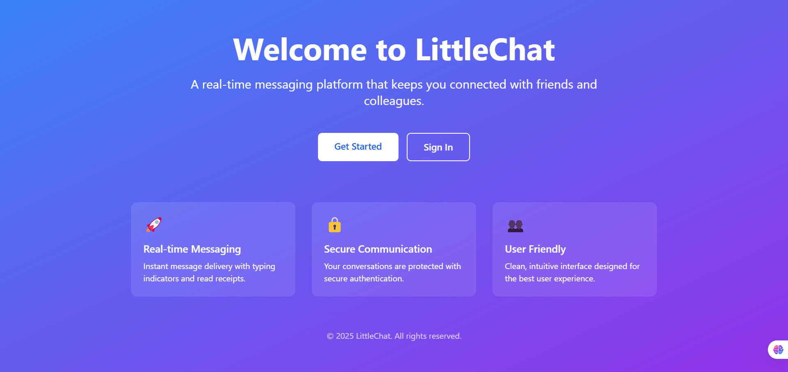
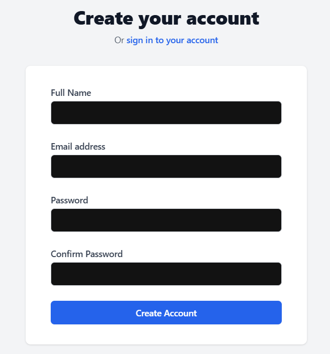
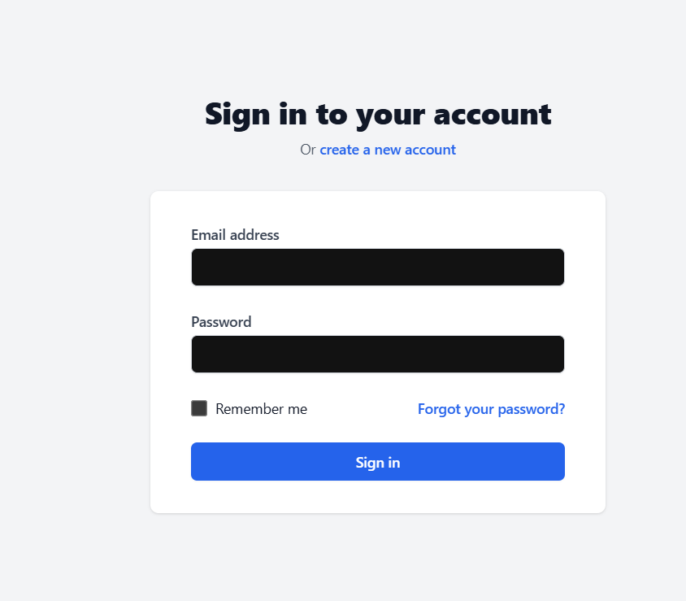
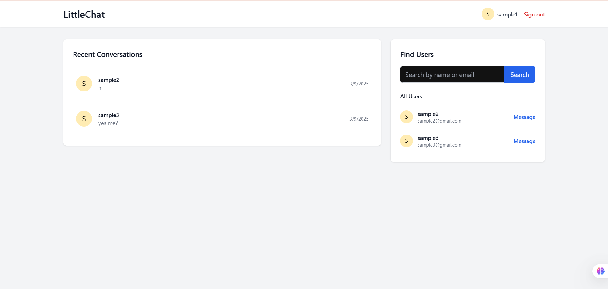
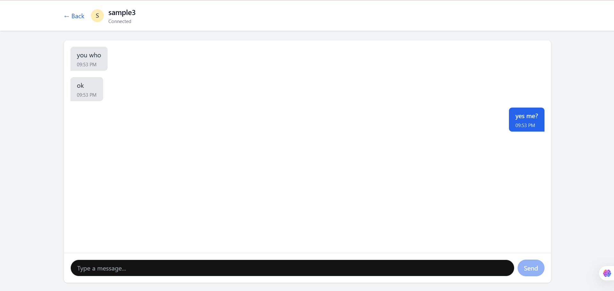

# LittleChat

A real-time chat application built with the MERN stack (MongoDB, Express, React, Node.js) and Socket.IO for instant messaging.

## Guest Credentials

You can use these sample accounts to test the application:

| Email | Password |
|-------|----------|
| sample1@gmail.com | sample1 |
| sample2@gmail.com | sample2 |
| sample3@gmail.com | sample3 |

## Features

- **User Authentication**: Secure login and registration system
- **Real-time Messaging**: Instant message delivery using Socket.IO
- **User Dashboard**: View and manage your contacts
- **Chat History**: Access your previous conversations
- **Typing Indicators**: See when someone is typing a message
- **Responsive Design**: Works on desktop and mobile devices

## Screenshots

### Landing Page


### Registration Page


### Sign In Page


### Dashboard


### Chat Interface


## How to Setup

### Cloning the project

```
git clone https://github.com/hsinghal11/LittleChat.git
```

### For Backend 
Setting up the backend:
```
cd .\Backend\
npm i 
```
- Create a `.env` file in the backend folder (see `.env_sample` for required variables)
- Start the server:
```
npm start
```
This will start nodemon for development.

### For Frontend 
Setting up the frontend:
```
cd .\Frontend\
npm i 
```
- The frontend uses environment variables for API URLs:
  - `.env.development` - Contains development API URL (http://localhost:4000)
  - `.env` - Contains production API URL (https://little-chat.vercel.app)
- Start the development server:
```
npm run dev
```
This will start Vite development server.

## Technologies Used

- **Frontend**: React.js, Tailwind CSS, Socket.IO Client
- **Backend**: Node.js, Express.js, Socket.IO
- **Database**: MongoDB
- **Authentication**: JWT (JSON Web Tokens)

## Project Structure

- **Frontend**: React application with components, contexts, and pages
- **Backend**: Express server with routes, controllers, and models
- **Socket**: Real-time communication implementation

## Future Enhancements

- Group chat functionality
- File sharing capabilities
- Read receipts
- User profile customization
- Message search functionality

## Contributing

Contributions are welcome! Please feel free to submit a Pull Request.

## License

This project is open source and available under the [MIT License](LICENSE).

